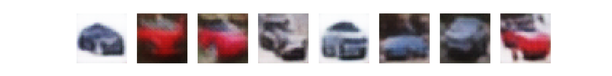

### Latent Diffusion Model on CIFAR-10

Implementation of a class-conditional Latent Diffusion Model from scratch in PyTorch, trained on CIFAR-10.

#### What This Is

A minimal but complete LDM pipeline:

VAE compresses images into a spatial latent space (8, 8, 8)
DDPM denoises in latent space instead of pixel space
Classifier-Free Guidance for class-conditional generation
Results

Cars generated from pure noise with guidance_scale=7.5:

#### Architecture

##### VAE

Encoder: Conv layers with ResBlocks + Self-Attention at bottleneck
Decoder: ConvTranspose layers mirroring encoder
Loss: MSE + Perceptual (VGG16 features) + KL with free bits

#### DDPM U-Net

Operates on (8, 8, 8) latents, not pixels
Time + class embeddings added to ResBlock features
Self-attention at bottleneck

Training
bash
###### 1. Train VAE
`python vae/train.py`

###### 2. Extract latents
`python ldm/extract_latents.py`

###### 3. Train DDPM
`python ddpm/train.py`

###### 4. Sample
`python ldm/sample.py --class_label 1 --guidance_scale 7.5`

#### Papers
Auto-Encoding Variational Bayes — Kingma & Welling
Denoising Diffusion Probabilistic Models — Ho et al.
High-Resolution Image Synthesis with Latent Diffusion Models — Rombach et al.
